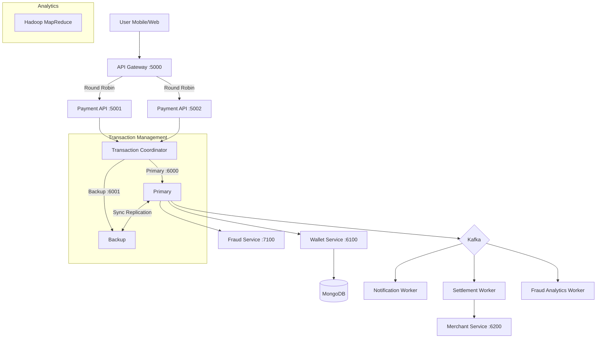

# PhonePay - Distributed Payment System

PhonePay is a production-grade distributed payment processing system inspired by PhonePe, demonstrating core Distributed Computing concepts through a real-world financial transaction pipeline.

## 🏗️ System Architecture



## 🚀 Features
- **Microservices Architecture**: 7 backend services + Gateway.
- **Distributed Transactions**: ACID guarantees with 2-Phase Commit.
- **Fault Tolerance**: Primary-Backup replication with automatic failover.
- **Load Balancing**: Round-robin distribution of API requests.
- **Event-Driven**: Kafka for async notifications and settlements.
- **Analytics**: Hadoop MapReduce for transaction analysis.
- **Real-time Fraud Detection**: Scoring engine for every transaction.

## 🛠️ Tech Stack
- **Backend**: Python (Flask), XML-RPC
- **Frontend**: React, TypeScript, Tailwind CSS
- **Database**: MongoDB (Transactions)
- **Message Queue**: Apache Kafka
- **Caching**: Redis
- **Big Data**: Hadoop MapReduce

## 📦 Setup Instructions

### Prerequisites
- Docker & Docker Compose
- Python 3.9+
- Node.js 16+

### 1. Start Infrastructure
```bash
docker-compose up -d
```

### 2. Start Backend Services
Run each command in a separate terminal:
```bash
# 1. RPC Logger
python backend/logging_service.py

# 2. Primary Coordinator
python backend/transaction_coordinator.py --role primary --port 6000 --peer http://localhost:6001

# 3. Backup Coordinator
python backend/transaction_coordinator.py --role backup --port 6001 --peer http://localhost:6000

# 4. Wallet Service
python backend/wallet_service.py

# 5. Merchant Service
python backend/merchant_service.py

# 6. Fraud Service
python backend/fraud_service.py

# 7. Payment API 1
python backend/payment_api.py --port 5001 --name PaymentAPI-1

# 8. Payment API 2
python backend/payment_api.py --port 5002 --name PaymentAPI-2

# 9. API Gateway
python backend/api_gateway.py

# 10. Workers
python backend/workers/notification_worker.py
python backend/workers/settlement_worker.py
python backend/workers/fraud_analytics_worker.py
```

### 3. Start Frontend
```bash
cd frontend
npm install
npm run dev
```

## 🧪 Verification
Run the end-to-end test script to verify the payment flow:
```bash
python backend/test_payment_flow.py
```

## 📚 API Documentation

### Payment API
- `POST /api/payment/initiate`: Start a transaction
- `GET /api/payment/status/:id`: Check status
- `GET /api/wallet/balance`: Get user balance

### Admin API
- `GET /admin/lb-stats`: Load balancer statistics
- `GET /admin/system-status`: Health check of all services
